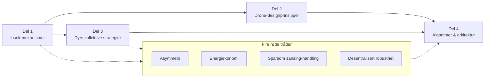
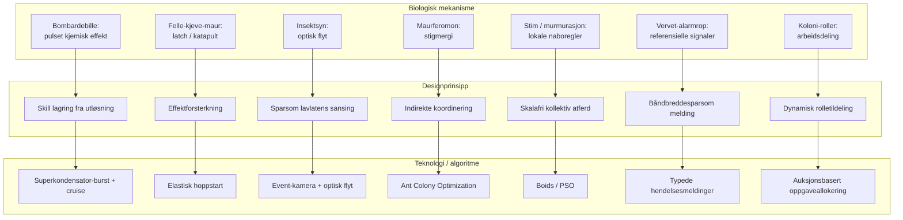
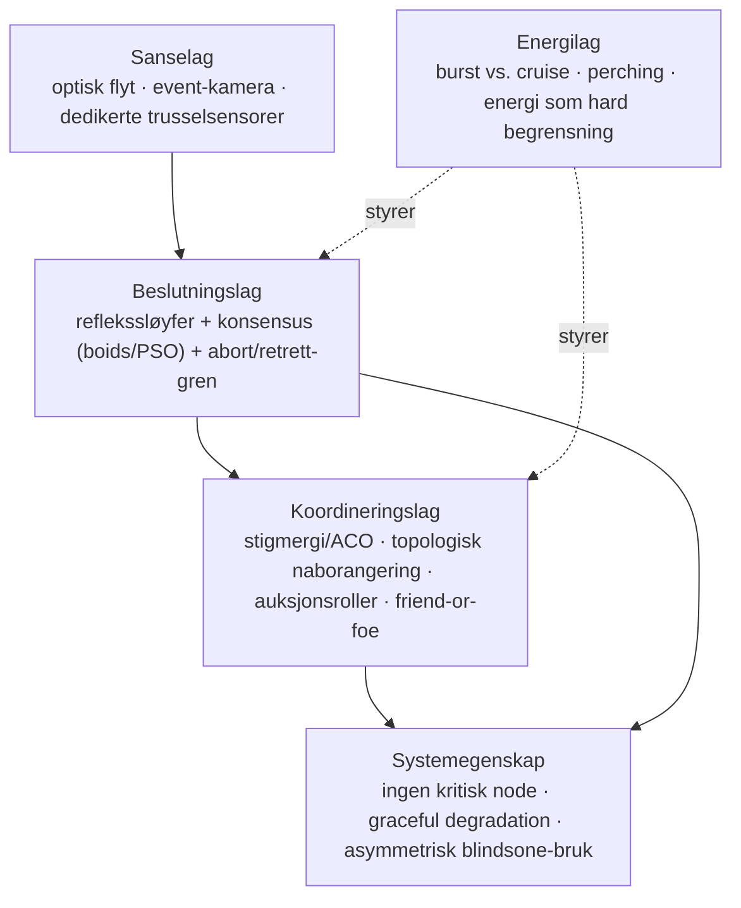
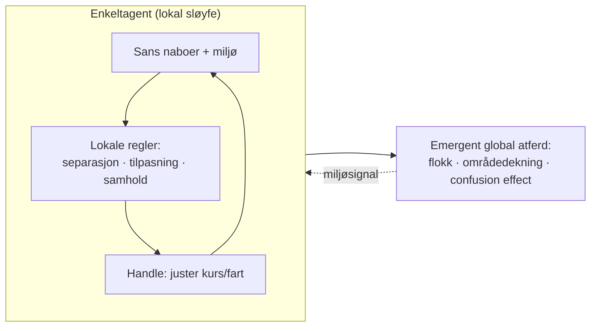
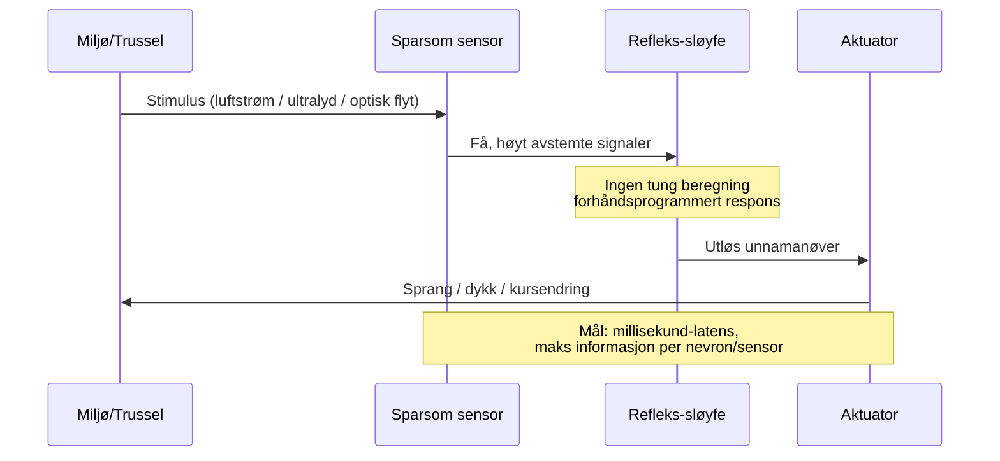
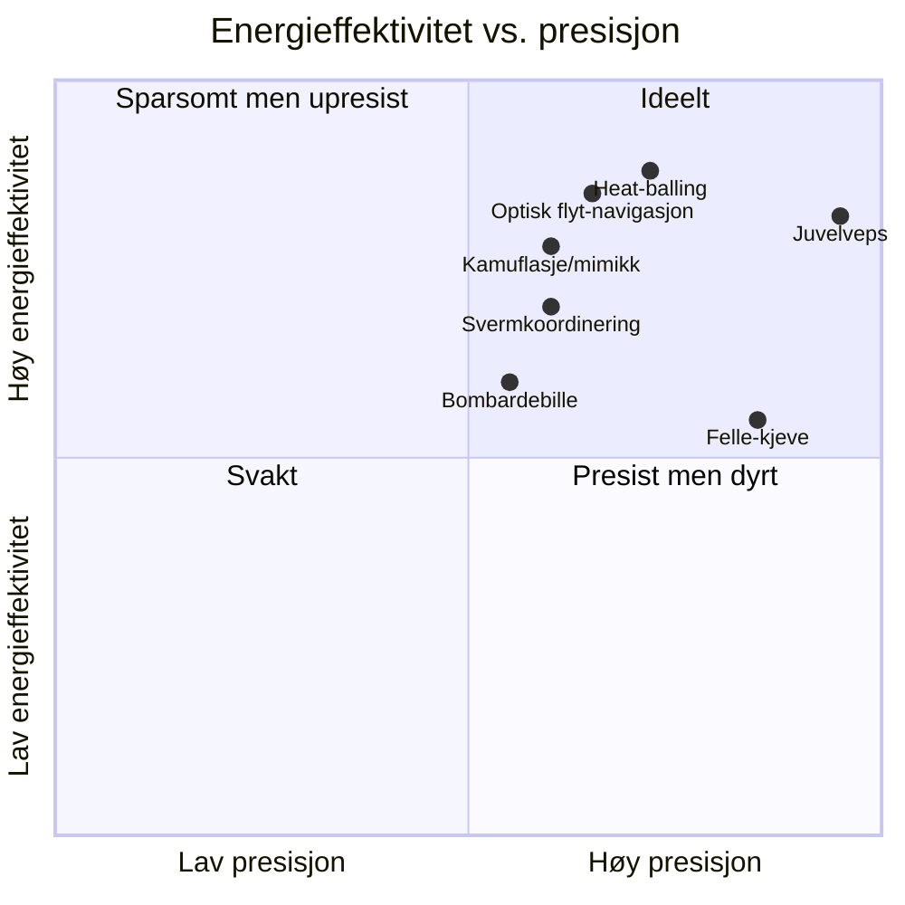

# Diagrammer – Biomimikk: insekter/dyr → dronedesign

Diagrammene under er skrevet i **Mermaid** og rendres automatisk på GitHub.

---

## Figur 1 — Den røde tråden: fra biologi til arkitektur

---

## Figur 2 — Mekanisme → prinsipp → algoritme/implementering

---

## Figur 3 — Lagdelt autonomi-arkitektur (syntese, Del 4)

---

## Figur 4 — Desentralisert svermsløyfe (lokale regler → global atferd)

---

## Figur 5 — Sansing-handling-sløyfe vs. latens (insekt-prinsipp)

---

## Figur 6 — Vurderingsmatrise (kvalitativ)

> *Plasseringene er kvalitative ekspertvurderinger for illustrasjon, ikke målte data.*
